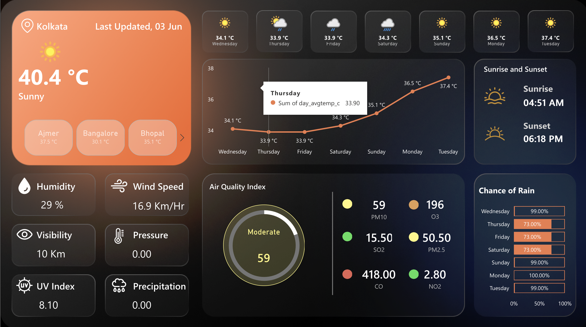

# 🌦️ Weather Analytics Dashboard | Python, MySQL, JavaScript, Power BI & AI Assistant

<p align="center">
  <b>Real-Time Weather Intelligence Platform Powered by OpenWeather API</b>
</p>

A complete end-to-end Weather Analytics platform built using **Python, MySQL, JavaScript, Power BI, REST APIs, and AI** to provide real-time weather monitoring, environmental analytics, and weather intelligence.

The platform automatically collects weather data from the OpenWeather API, stores it in a MySQL database through a Python pipeline, visualizes weather metrics through Power BI dashboards, and provides an AI-powered assistant capable of answering weather-related questions using live and historical data.

---

# 🎯 Project Objectives

The project was designed to deliver:

✅ Current Weather Monitoring

✅ Multi-City Weather Tracking

✅ Air Quality Analysis

✅ Forecast Trend Visualization

✅ Environmental Analytics

✅ Weather Forensics

✅ Power BI Reporting

✅ AI-Powered Weather Assistant

✅ Automated Data Refresh

✅ Historical Weather Analysis

---

# 🏗️ Tech Stack

## Data Engineering

* Python
* Pandas
* Requests

## API Source

* OpenWeather API

## Database

* MySQL (Hosted on **Aiven Cloud**)

## Backend

* JavaScript
* Node.js
* Express.js

## Business Intelligence

* Power BI

## AI Layer

* Groq LLM
* Natural Language Query Engine

## Frontend

* HTML
* CSS
* JavaScript

## Deployment

* Vercel (Web Application)

## Automation

* GitHub Actions (Scheduled Database Refresh)

## Version Control

* Git
* GitHub

---

# ⚙️ System Architecture

The platform follows a fully automated weather analytics workflow.

### Data Pipeline

1. Python fetches weather data from OpenWeather API.
2. Current weather information is transformed into structured datasets.
3. Python automatically creates MySQL tables.
4. Weather records are inserted into the Aiven-hosted MySQL database.
5. JavaScript backend serves weather data to the website.
6. Power BI connects directly to OpenWeather API endpoints.
7. Dashboard refresh loads the latest weather information.
8. AI assistant interacts with weather datasets.
9. User questions are converted into SQL queries.
10. Results are returned as insights, forecasts, and weather analysis.

---

# ☁️ Cloud Database — Aiven

The MySQL database is hosted on Aiven, a fully managed open-source cloud database platform. This enables:

* Secure remote connectivity from the web app, Power BI, Python pipeline, and GitHub Actions
* High availability with automated backups
* Easy scalability as more cities and metrics are added
* SSL-encrypted connections for data security

---

# ⏰ Automated Database Refresh — GitHub Actions

The data refresh pipeline is **fully automated using GitHub Actions**, ensuring weather data stays current without any manual intervention.

### How It Works

* A scheduled GitHub Actions workflow runs at defined intervals (e.g., every few hours).
* The workflow triggers the Python data pipeline automatically.
* Python fetches the latest weather data from the OpenWeather API.
* Fresh records are inserted into the Aiven-hosted MySQL database.
* Power BI dashboards and the web app reflect the updated data on the next load.

### Benefits

* Zero manual intervention required
* Always up-to-date weather and air quality data
* Reliable scheduling with full execution logs
* Runs entirely in the cloud — no local machine needed

---

# 📊 Dashboard Features

The dashboard provides a complete weather overview for monitored locations.

### Current Weather

* Current Temperature
* Weather Condition
* Last Updated Date
* City Information

### Environmental Metrics

* Humidity
* Wind Speed
* Visibility
* Pressure
* UV Index
* Precipitation

### Air Quality Monitoring

* AQI Score
* PM10
* PM2.5
* SO₂
* NO₂
* O₃
* CO

### Forecast Analytics

* 7-Day Temperature Forecast
* Rain Probability Forecast
* Daily Weather Conditions

### Solar Information

* Sunrise Time
* Sunset Time

---

# 📈 Dashboard Screenshot

<h2 align="center">🌦️ Weather Analytics Dashboard</h2>

<p align="center">
  
</p>

### Information Displayed

The dashboard currently displays:

#### Weather Summary

* City Name
* Current Temperature
* Weather Condition
* Last Updated Date

#### Multi-City Quick View

Weather cards showing:

* Ajmer
* Bangalore
* Bhopal

along with their latest temperatures.

#### Forecast Panel

7-Day forecast displaying:

* Daily Weather Icons
* Daily Temperatures
* Day Names

#### Temperature Trend

Line chart showing forecast temperature movement across upcoming days.

#### Sunrise & Sunset

Dedicated panel displaying:

* Sunrise Time
* Sunset Time

#### Environmental Metrics

Cards showing:

* Humidity (%)
* Wind Speed (Km/Hr)
* Visibility (Km)
* Pressure
* UV Index
* Precipitation

#### Air Quality Index

AQI panel displaying:

* Overall AQI Score
* AQI Classification

Pollutants:

* PM10
* SO₂
* CO
* O₃
* PM2.5
* NO₂

#### Rain Probability Analysis

Bar chart displaying rain probability percentages for upcoming forecast days.

---

# 🔍 Weather Forensics

The platform supports weather intelligence and environmental analysis.

### Capabilities

* Temperature Trend Analysis
* Rain Probability Tracking
* Air Quality Monitoring
* Pollution Pattern Detection
* Environmental Risk Analysis
* Weather Change Monitoring
* Historical Comparison
* Forecast Validation

---

# 🤖 AI Weather Assistant

The platform includes a conversational AI assistant powered by Groq LLM.

Users can ask questions in natural language and receive responses generated from weather datasets stored in the Aiven-hosted MySQL database.

### Example Questions

* What is today's weather in Kolkata?
* Which day has the highest forecast temperature?
* Is rain expected this weekend?
* Compare humidity levels across tracked cities.
* What is the current AQI status?
* Which pollutant contributes most to air quality concerns?
* Explain the temperature trend for the next 7 days.
* Is the weather improving or deteriorating?

### AI Features

✅ Natural Language Queries

✅ SQL Query Generation

✅ Weather Explanations

✅ Forecast Interpretation

✅ Environmental Analytics

✅ Air Quality Insights

✅ Historical Weather Analysis

---

# 🧠 Advanced MySQL Weather Analytics Questions Solved

## 1. Latest Temperature by City

```sql
SELECT city,
MAX(temperature) AS latest_temperature
FROM weather_data
GROUP BY city;
```

## 2. Average Temperature by City

```sql
SELECT city,
ROUND(AVG(temperature),2)
FROM weather_data
GROUP BY city;
```

## 3. Highest Recorded Temperature

```sql
SELECT city,
MAX(temperature)
FROM weather_data
GROUP BY city;
```

## 4. Lowest Recorded Temperature

```sql
SELECT city,
MIN(temperature)
FROM weather_data
GROUP BY city;
```

## 5. Average Humidity

```sql
SELECT city,
AVG(humidity)
FROM weather_data
GROUP BY city;
```

## 6. Highest Wind Speed

```sql
SELECT city,
MAX(wind_speed)
FROM weather_data
GROUP BY city;
```

## 7. Average AQI Score

```sql
SELECT city,
AVG(aqi)
FROM weather_data
GROUP BY city;
```

## 8. Maximum PM2.5 Value

```sql
SELECT city,
MAX(pm25)
FROM weather_data
GROUP BY city;
```

## 9. Maximum PM10 Value

```sql
SELECT city,
MAX(pm10)
FROM weather_data
GROUP BY city;
```

## 10. Average UV Index

```sql
SELECT city,
AVG(uv_index)
FROM weather_data
GROUP BY city;
```

## 11. Rain Probability Analysis

```sql
SELECT forecast_day,
AVG(rain_probability)
FROM weather_forecast
GROUP BY forecast_day;
```

## 12. Temperature Forecast Trend

```sql
SELECT forecast_day,
temperature
FROM weather_forecast
ORDER BY forecast_day;
```

## 13. Sunrise and Sunset Analysis

```sql
SELECT city,
sunrise,
sunset
FROM weather_data;
```

## 14. Pollution Ranking by City

```sql
SELECT city,
(pm25 + pm10 + co + no2 + so2 + o3) AS pollution_score
FROM weather_data
ORDER BY pollution_score DESC;
```

## 15. Weather Condition Distribution

```sql
SELECT weather_condition,
COUNT(*)
FROM weather_data
GROUP BY weather_condition;
```

---

# ⚡ Power BI Integration

Power BI is connected directly to OpenWeather API sources and the Aiven-hosted MySQL database.

When dashboard refresh is triggered:

1. Power BI requests latest weather data.
2. OpenWeather API returns fresh records.
3. Dashboard visuals update automatically.
4. Forecast and environmental metrics refresh instantly.

No manual file uploads are required.

---

# 🌐 Web Application & AI Assistant Demo

An interactive web application was built on top of the analytics platform, bringing the weather dashboard and AI assistant into the browser.

## 🖥️ Website

The web app displays live weather data, forecasts, and air quality metrics for all tracked cities — powered by a Node.js/Express backend connected to the Aiven-hosted MySQL database and OpenWeather API.

🔗 **Live Demo: [View on Vercel](https://your-project.vercel.app)**

## 🤖 Groq LLM Chatbot

Users can type any weather-related question in plain English. The Groq LLM converts it to SQL, executes it on the Aiven database, and returns the result along with the query used.

## 🎥 Demo Video

Watch the full platform walkthrough including the web dashboard and AI assistant:

[](https://www.loom.com/share/your-video-id-here)

> 🔗 **Loom Link:** [https://www.loom.com/share/your-video-id-here](https://www.loom.com/share/your-video-id-here)

---

# ⭐ Project Highlights

* OpenWeather API Integration
* Automated Python Data Pipeline
* MySQL Weather Data Warehouse on Aiven Cloud
* Scheduled Database Refresh via GitHub Actions
* Advanced SQL Analytics
* Interactive Power BI Dashboard
* Air Quality Monitoring
* Weather Forecast Visualization
* Environmental Analytics
* AI-Powered Weather Assistant
* Natural Language to SQL Engine
* Real-Time Dashboard Refresh
* Live Web Application Deployed on Vercel
* Weather Forensics Platform

---
